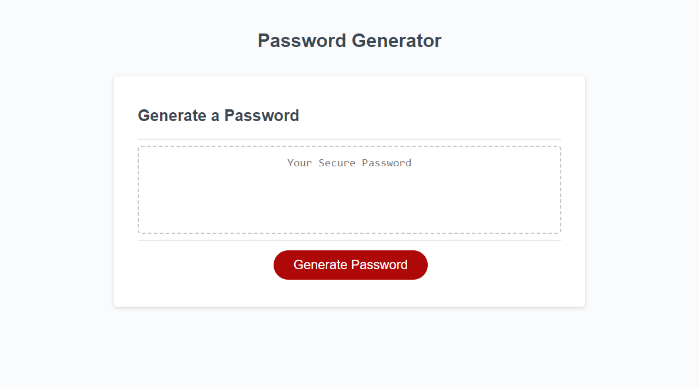

# Password-Generator--Challenge-3

## Description

With the goal of generating a secure password, I created a password gennerator. I added user input for the length of the password. I set an alert if the length requested was outside of the min-max of 8 and 128 characters. I then required the user to select whether of not they wanted to include special characters, numeric charaters, lowercase charaters or uppercase characters. I set an alert if the user did not select at least one option. Finally, I tested and confirmed that if all promtps are answered, a random password was written on the page.

## Installation

N/A

## Usage

https://ericolson1977.github.io/Password-Generator--Challenge-3/

## Credits

N/A

## License

Please refer to the LICENSE in the repo.

---